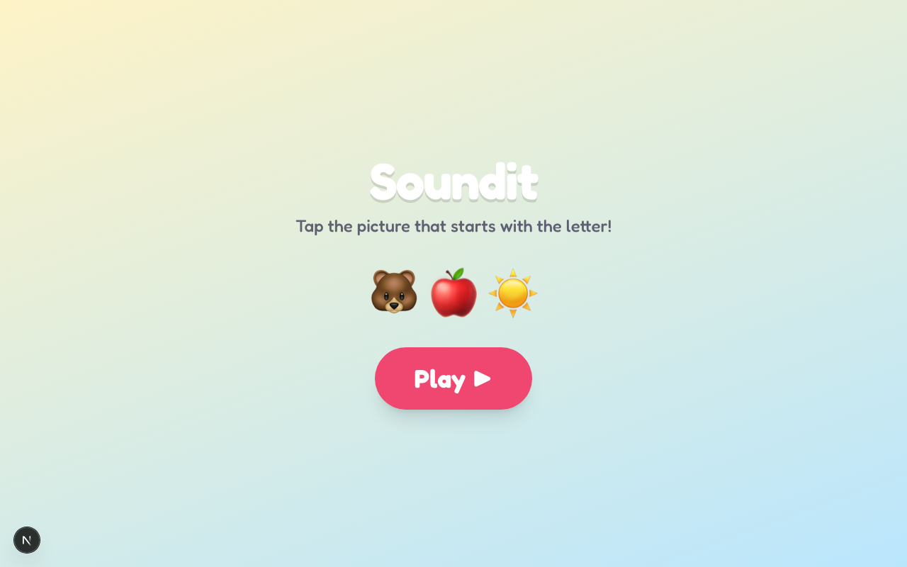

# Soundit

**Live:** https://soundit.100dayaichallenge.com

A tap-to-match phonics game for preschoolers. A big letter appears, the app says its name and sound out loud ("B... buh"), and the child taps the picture that starts with that sound. Get 10 right and the screen erupts in confetti.

Built for little fingers on a phone or tablet: huge tap targets, no reading required, no way to lose.

## Features

- **See it, hear it, tap it** — each round shows a letter and speaks its name + phonics sound; tap the emoji that starts with it.
- **Warm, encouraging feedback** — correct answers get a happy chime and a bounce; wrong answers get a gentle shake and a retry, never a penalty.
- **Star progress** — fill 10 stars to reach a confetti celebration and Play Again.
- **No files, no setup** — success/feedback sounds are synthesized with the Web Audio API and the letter is spoken via the browser's speech synthesis, so there are no audio assets to load. A sound toggle is there for quiet time.
- **Kid-proofed & responsive** — locked zoom, chunky rounded buttons, bright playful palette, and a mobile/tablet-first layout.

## Screenshot



## Install

```bash
git clone https://github.com/Still-InFrame/day-30-soundit.git
cd day-30-soundit
npm install
npm run dev
```

Then open http://localhost:3000 and tap **Play**. (The first tap unlocks audio — a browser requirement.)

## Stack

Next.js 16 (App Router) · React 19 · TypeScript · Tailwind CSS v4 · Web Audio API · SpeechSynthesis · canvas-confetti.

---

Day 30 of Savion's [100 Day AI Build Challenge](https://www.100dayaichallenge.com/share/savion) — one new app every day.
